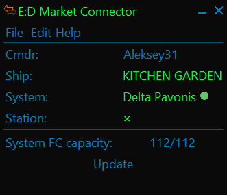

# What is it
EDMC plugin for determining current system FC capacity, can be useful to decide if it cost to try schedule FC jump to a system.

*Plugin shows all FC slots is occupied in current system. First 112 means how many FCs in system, second 112 means how many 
FC slots in current system*

***Works only when you are directly in target system, on your ship, with turned on EDMC with this plugin***

# How it works
Common formula: system FC capacity = number of bodies in the system * 16\
So in order to calculate maximum FC capacity of the system, we need to get know how many bodies does it have.\
The plugin uses `FSSSignalDiscovered` and `FSSDiscoveryScan` events from player journal:
1. `FSSSignalDiscovered`: On entering to supercruise/jumping to a system and making
basic scan by discovery scanner (just hold fire with bound discovery scanner) the game throws to player journal a 
`FSSSignalDiscovered` event for every FC in the system, so we can count it.
2. `FSSDiscoveryScan`: The plugin uses `BodyCount` field of the `FSSDiscoveryScan` event to get the number of bodies in the system.
This event throwing to player journal once you performed basic scan by discovery scanner (similar as for `FSSSignalDiscovered` 
events).

# How to use it
1. Basically, the best case is when you jump in to a system and performing scan by discovery scanner, it will give you current
system capacity immediately.
2. If you are already in target system and only now started EDMC then you have to exit to main menu, back in game, enter in 
supercruise, and you will have current system FC capacity (it is because game doesn't throw `FSSSignalDiscovered`
events more than one time per session/system visit).
3. If you just logged in game and already are in target system then you have to launch EDMC and jump in supercruise, you will
get current system FC capacity.

Please also note that **the plugin will reset system FC capacity after every jump to a system or entering to supercruise**,
basically, it means that you will have system FC capacity only in short time until you don't get in supercruise again,
this behaviour may (and probably will) be changed in the future.

 
 